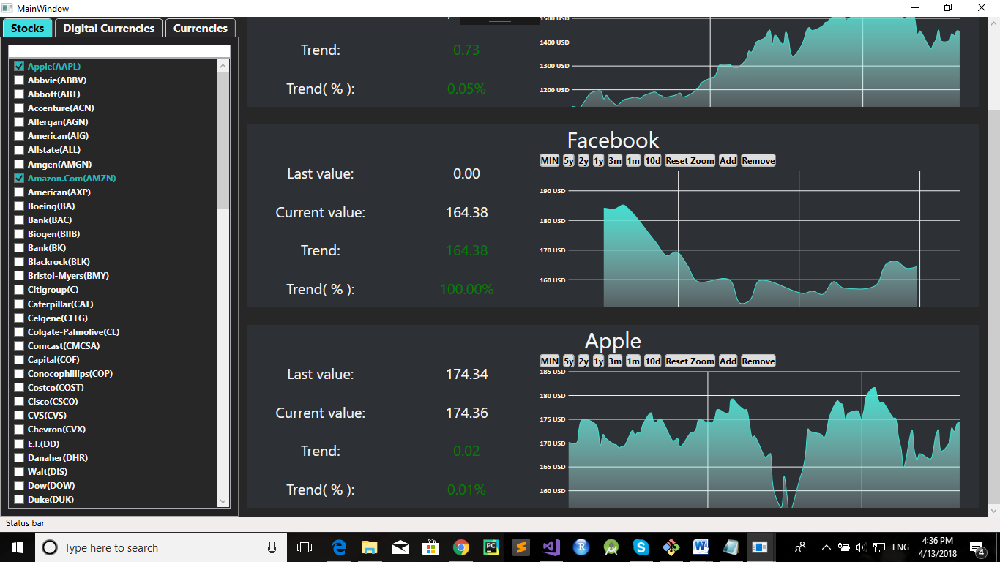
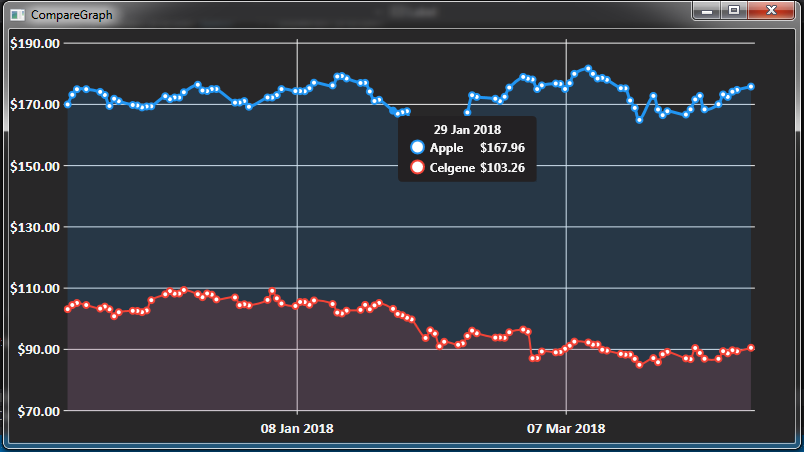

# Stocks

Stocks is desktop application for monitoring values of stocks, currencies and cryptocurrencies.
Application allows:
- showing real-time values of stocks, currencies and cryptocurrencies
- showing records of trends and history values for stocks, currencies and cryptocurrencies
- comparation of trends and history values among stocks, currencies and cryptocurrencies

#

